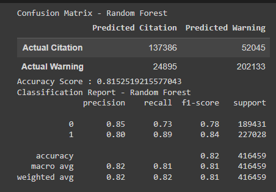

# Project_4

 #### State column has the following invalid values:
 +-----+
|State|
+-----+
|   AB|
|   BC|
|   IT|
|   MB|
|   MH|
|   NB|
|   NF|
|   NS|
|   ON|
|   PE|
|   PQ|
|   QC|
|   SK|
|   US|
|   XX|
|   YT|
+-----+

#### DL State column has the following invalid values:
DL State|
+--------+
|      AB|
|      BC|
|       F|
|      IT|
|       M|
|      MB|
|      MH|
|      NB|
|      NF|
|      NS|
|      NU|
|      ON|
|      PE|
|      PQ|
|      QC|
|      SK|
|      US|
|      XX|
|      YT|

    Query used:
    spark.sql(""" select distinct (`DL State`) from traffic_data
          where UPPER(`DL State`) not in ('AL','AK','AZ','AR','AS','CA','CO','CT','DE','DC','FL','GA','GU','HI','ID','IL',
          'IN','IA','KS','KY','LA','ME','MD','MA','MI','MN','MS','MO','MT','NE','NV','NH','NJ','NM','NY','NC','ND',
          'MP','OH','OK','OR','PA','PR','RI','SC','SD','TN','TX','TT','UT','VT','VA','VI','WA','WV','WI','WY')
          order by 1  
          """).show()

Note: There are lot of records with the invalid DL State value. Below is an example of records with DL State as 'XX'

State Shortcuts in the following table are considered valid:

Separating date of stop into year, month, and day.

data_cleaning_binning.ipynb has an example of binning the makes. 

sm_random_forest.ipynb has my attempt at running the random forest model. It keeps having trouble with the categorical 
variables, so I tried on hot encoding some of them. It then threw the error "Unable to allocate 7.48 GiB for an array with shape (4485, 1790375) and data type uint8"

Working on running the random forest model in google colab.

Steps SM will take today: Clean up the make column, bin the state, potentially get the color down to not flashy colors and flashy colors, and binning the makes.
