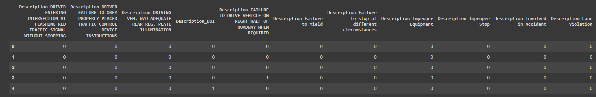

# Project 4- Traffic Violations
------------
## Project Description

### Goal
Use EDA, machine learning, and visualization to analyze a dataset of traffic violations from Maryland from the years 2012 to 2023. 

------------
## Credits
ChatGPT was used for some portions for researching approaches to tasks. The data used was from https://data.montgomerycountymd.gov/.

------------
## Softwares Used
### Libraries
Pathlib
Scikit Learn
   ensemble.RandomForestClassifier
   linear_model.LogisticRegression
   model_selection.train_test_split
   metrics.confusion_matrix, accuracy_score, classification_report
Pandas
Matplotlib
Pyspark
   sql.Spark Session
Hadoop
Parquet
Time
OS

### Language
Python
SQL

### Software
VSCode
GitLens

------------
## Exploratory Data Analysis
-  Read the csv into a dataframe.
-  Dropped columns that were deemed to be represented by other columns or columns that were not valuable.
-  Dropped safety related violation types so that only violation types of warning and citation are the only
   rows left.
-  'Violation Type' is the target feature.
-  Dropped rows with invalid years.
-  Removed data that had the latitude and longitude set as zero.
-  Converted the 'Date of Stop' and 'Time of Stop' features to Year of Stop, Month of Stop, and Hour of Stop.
-  Dropped rows with a null description.
-  Used Regex to replace descriptions with specific key words to make the descriptions more uniform for
   machine learning modelling.
   -  Examples of some descriptions that were standardardized contain some or all of the words or phrases:
      -  Speeding: Exceeding Speed Limit, Speed, and Speeding
      -  Failure to Yield: Fail Yield and Failure Yield
      -  Learner Permit
      -  Improper Equipment: Lamp, Headlight, Required Minimum Equipment, and Inoperative
      -  DUI: Influence Alcohol and Impaired Alcohol
-  25 groups of descriptions were classified using regex to reduce the number of unique descriptions to 
   around 5000 descriptions which were then binned to make descriptions with less than 10,000 occurances be classified as 'Other' leaving the top 25 descriptions.
-  The license plate state feature was categorized into in-state (MD) and out of state (all others).
-  The Make feature contained many errors. The Make values were manually corrected through makes that had
   10 or more values in the dataset. The makes with 9 or less values were classified as 'Other'.
   -  If the make value did not have a clear correction, the value was set to unknown.
-  The Date of Stop, Driver State, State and Time of Stop features were dropped from the dataframe because the
   values contained in these columns was represented in other, more meaningful, columns.
-  The colors of cars were classified into neutral colors and colorful colors.
-  The resulting dataframe was written to a .csv file called Traffic_Violations_Processed to be used for 
   machine learning modelling.

## Machine Learning Modelling
-  The Traffic_Violations_Processed.csv was read into a dataframe.
-  The dataframe was limited to the columns 'Description', 'Accident', 'Alcohol', 'Search Outcome', 'Violation
   Type', and 'License Plate State Category'.
-  The rows with null values had the null value replaced with the word 'None'.
-  All of the remaining columns were one hot encoded with pd.get_dummies.

### Example of One Hot Encoded Features

-  The features were separated from the target feature and assigned the variable X.
-  The target feature, 'Violation Type', was assigned the variable y.
-  The features and target were split into test data and train data with train_test_split.
-  A random forest model was instatiated, the training data was fit to the model, the model was used to predict
   the test data, a confusion matrix was calculated and the results of the confusion matrix were displayed.

### Random Forest Confusion Matrix
   

-  A logistic regression model was instantiated with the solver 'sag', 200 max iterations, and random state of 1.
-  The training data was fitted with the logistic regression model, predictions were made with the logistic
   regression model on the test data, a confusion matrix was calculated and the results of the confusion matrix were displayed.

### Logistic Regression Confusion Matrix

## Pyspark and Partitioning
-  Spark and Java were installed in google colab and the environmental variables JAVA_HOME and SPARK_HOME were
   set.
-  A spark session was initiated.
-  The Traffic_Violations_Processed.csv was read into pyspark with inferSchema set as True.
-  A temporary view of the dataframe was created.
-  Using sql queries, the following was displayed:
   -  The first 5 rows of the dataframe were displayed with a query.
      

   -  The total number of rows.
      

   -  The distribution of Violation Types. 
      

   -  The minimum and maximum year of stop in the table.
      

   -  The number of distinct descriptions
      

   -  The top 25 descriptions.
      

   -  The number of violations organized/partitioned by 'Description' with and without partitioning.
      -  Without partitioning, the query took 9.3 seconds.
      -  With partitioning, the query took 1.4 seconds.
   -  The locations with the most speeding incidents in November 2023.
      -  Without partitioning, the query took 9.0 seconds.
      -  With partitioning, the query took 0.9 seconds.

### Partitioning with Parquet

## Visualizing in Tableau
https://public.tableau.com/app/profile/samantha.mckay/viz/UpdatedTrafficViolationsM/MapofViolations?publish=yes

### Hours of Accidents and Violations

### Accidents and Fatalities by Season
 

### Violations Received by Race and Gender and Racial Car Color Distribution

### Make Distribution by Gender and Violations Received by Gender

### Make Distribution by License Plate Category

### Map of Violations

### Total Accidents by Vehicle Year

## Analysis
-  The random forest model was slightly more accurate than the linear regression model. 
-  The linear regression had better recall for the citation violations.
-  Hispanic men were the only race/gender group that had more citations than violations.
-  The five most common makes of vehicle were Toyota, Honda, Chevrolet, Ford, and Nissan.
-  Most racial groups had a majority of black cars with the exception of Asians having a majority of silver
   vehicles and Hispanic peopl having a majority of white vehicles.
-  Overall, fewer accidents occur around 5 am and the most accidents occur at 5pm.
-  Summer has the most fatalities, followed by spring, fall and then winter.

## Conclusion
The dataset we used was large and was difficult to parse through. The features that appeared to be free form (Description and Make/Model) would need significantly more work to perfect, but using regex worked well to make the descriptions more uniform. In future, regex would be useful for the make feature. When we started this project, it was of particular interest whether Gender, Race, Make of Vehicle and Color of Vehicle could be used to predict what type of violation would be given to the individual. More work is necessary to find the correct balance of columns to use these features to predict with precision and accuracy. The description is, in theory, the most powerful column as it is specific to the violation that occurred and would have more significance on predicting the type of violation. It would be useful to have the driver's age to help make predictions. For data analysis purposes, many of the columns that are filled out should be drop downs to eliminate errors and make EDA easier.